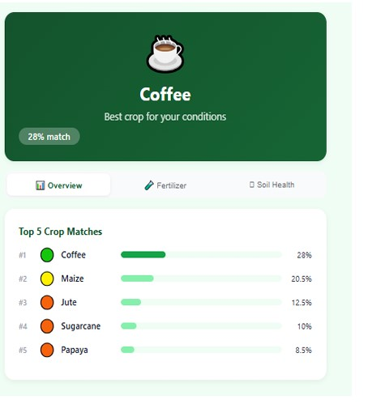

# 🌱 CropSmart

## Climate-Smart Agricultural Prediction & Soil Management Platform

CropSmart is a full-stack **Climate Smart Agriculture** platform that uses **Machine Learning, weather information, soil data, and agricultural recommendations** to help users make data-driven crop-selection and soil-management decisions.

The system combines a **React.js frontend**, **Node.js/Express backend**, **MongoDB database**, and a **Python Flask Machine Learning service**. A **Random Forest Classifier** is used to recommend suitable crops based on soil nutrients, environmental conditions, rainfall, soil pH, and season.

---

## 📸 Application Screenshots

### 🌱 Soil & Climate Inputs

Users can provide important agricultural and environmental parameters such as Nitrogen, Phosphorus, Potassium, temperature, humidity, soil pH, rainfall, and season.


---

### 🌾 Crop Recommendation Results

After submitting the inputs, CropSmart generates the best crop recommendation along with the **Top 5 Crop Matches** and their confidence scores.



---

# 📌 Project Overview

Agricultural productivity depends on several environmental and soil-related factors such as:

- Soil nutrient availability
- Soil pH
- Temperature
- Humidity
- Rainfall
- Agricultural season
- Local environmental conditions

Selecting an unsuitable crop can result in reduced productivity and inefficient utilization of agricultural resources.

**CropSmart** addresses this problem by providing a web-based decision-support platform that combines Machine Learning with environmental and soil information to generate crop recommendations.

The platform provides:

- 🌾 Top 5 crop recommendations
- 📊 Crop confidence scores
- 🌱 Soil health analysis
- 🧪 Fertilizer recommendations
- 🌦️ Weather information
- 📍 Location-based environmental information
- 📜 Prediction history
- 🔐 User authentication
- 🌐 Multilingual support

---

# 🎯 Problem Statement

Farmers need to consider multiple factors before selecting a suitable crop. Soil nutrients, rainfall, temperature, humidity, soil pH, and seasonal conditions can significantly influence crop suitability.

Traditional crop-selection decisions may rely heavily on general recommendations or personal experience.

CropSmart aims to provide a **Machine Learning-based agricultural decision-support system** that analyzes multiple environmental and soil parameters and recommends crops that are suitable for the given conditions.

---

# 💡 Proposed Solution

CropSmart integrates a web application with a Machine Learning prediction service.

The overall process is:

```text
                    User
                      │
                      ▼
              React Frontend
                      │
                      ▼
             Node.js / Express
                  Backend
                      │
          ┌───────────┼
          │           │            
          ▼           ▼            
       MongoDB     Weather      
                    API           
          │
          │
          ▼
       Python Flask
        ML Service
          │
          ▼
    Random Forest Model
          │
          ▼
   Crop Recommendations
          │
          ▼
     Results Dashboard
```

---

# ✨ Key Features

## 🌾 1. Crop Recommendation

CropSmart analyzes the following agricultural and environmental parameters:

- **Nitrogen (N)**
- **Phosphorus (P)**
- **Potassium (K)**
- **Temperature**
- **Humidity**
- **Soil pH**
- **Rainfall**
- **Season**

The Machine Learning model generates a ranked list of the **Top 5 recommended crops**.

---

## 📊 2. Prediction Confidence

CropSmart uses the prediction probabilities generated by the Random Forest model to provide confidence/match scores for the recommended crops.

Instead of displaying only one crop, the system presents multiple suitable crop options ranked according to their predicted suitability.

---

## 🌱 3. Soil Health Analysis

The backend contains dedicated functionality for analyzing soil-related parameters and providing information about soil condition.

Relevant implementation files include:

backend/utils/soilHealth.js
backend/utils/validateInputs.js


---

## 🧪 4. Fertilizer Recommendations

CropSmart provides fertilizer-related recommendations using agricultural rules and fertilizer information maintained within the backend.

Relevant files include:

backend/utils/fertilizerDB.js
backend/utils/cropRules.js

---

## 🌦️ 5. Weather Information

CropSmart integrates weather information using the **Open-Meteo API**.

The backend contains a dedicated weather route:

backend/routes/weather.js

Weather information provides additional environmental context for agricultural decisions.

---

## 🔐 6. User Authentication

CropSmart provides user registration and login functionality.

Authentication uses:

- JSON Web Tokens (JWT)
- bcrypt password hashing
- Authentication middleware
- MongoDB user storage

Important authentication files:

backend/routes/auth.js
backend/middleware/authMiddleware.js
backend/models/User.js


User passwords are hashed before being stored.

---

## 📜 7. Prediction History

Authenticated users can maintain and retrieve their previous crop-prediction records.

Relevant implementation files:

backend/models/Prediction.js
backend/routes/history.js

---

## 🌐 8. Multilingual Support

The frontend provides multilingual support using **react-i18next**.

Currently supported languages include:

- 🇬🇧 English
- 🇮🇳 Telugu

Translation files are located at:

frontend/src/i18n/
├── en.json
├── hi.json
└── te.json


---

# 🧠 Machine Learning

## Random Forest Classifier

CropSmart uses a **Random Forest Classification** model for crop recommendation.

The model is trained using an augmented crop recommendation dataset.

### Model Details

| Property               | Value                               |
|------------------------|-------------------------------------|
| Algorithm              | Random Forest Classifier            |
| Number of Trees        | 200                                 |
| Number of Crop Classes | 22                                  |
| Training Dataset       | `Crop_recommendation_augmented.csv` |
| Reported Test Accuracy | 99.80%                              |
|______________________________________________________________|

> **Note:** The reported 99.80% accuracy is the result obtained during the project's model evaluation. Actual performance can vary depending on the dataset, data split, preprocessing, and evaluation methodology.

---

## 📥 Machine Learning Features

The model uses the following major features:

| Feature     | Description               |
|-------------|---------------------------|
| N           | Nitrogen content          |
| P           | Phosphorus content        |
| K           | Potassium content         |
| Temperature | Environmental temperature |
| Humidity    | Environmental humidity    |
| pH          | Soil acidity/alkalinity   |
| Rainfall    | Rainfall information      |
| Season      | Agricultural season       |
|_________________________________________|
---

## 🤖 Machine Learning Pipeline

```text
Crop Dataset
     │
     ▼
Data Preparation
     │
     ▼
Feature Processing
     │
     ▼
Season Encoding
     │
     ▼
Random Forest Training
     │
     ▼
Model Evaluation
     │
     ▼
Trained Model
     │
     ▼
crop_model.pkl
     │
     ▼
Python Flask API
     │
     ▼
Prediction Request
     │
     ▼
Crop Recommendation
```

The trained model is stored at:

```text
ml-model/crop_model.pkl
```

---

# System Architecture

```text
                         ┌───────────────────┐
                         │       USER        │
                         └─────────┬─────────┘
                                   │
                                   ▼
                         ┌───────────────────┐
                         │   React Frontend  │
                         │                   │
                         │    Port: 3000     │
                         └─────────┬─────────┘
                                   │
                              REST APIs
                                   │
                                   ▼
                         ┌───────────────────┐
                         │ Node.js + Express │
                         │      Backend      │
                         │                   │
                         │    Port: 5000     │
                         └────┬───────┬──────┘
                              │       │
                 ┌────────────┘       └──────────────┐
                 │                                   │
                 ▼                                   ▼
        ┌────────────────┐                 ┌─────────────────┐
        │    MongoDB     │                 │ Python Flask ML │
        │                │                 │      API        │
        │ • Users        │                 │                 │
        │ • Predictions  │                 │ Port: 5001      │
        └────────────────┘                 └────────┬────────┘
                                                    │
                                                    ▼
                                          ┌──────────────────┐
                                          │  Random Forest   │
                                          │      Model       │
                                          └──────────────────┘

                    External Services
                    ─────────────────

                 ┌──────────────┐
                 │  Open-Meteo  │
                 │   Weather    │
                 └──────────────┘
```

---

# 🔄 Application Workflow

```text
1. User opens CropSmart
             │
             ▼
2. User registers / logs in
             │
             ▼
3. User provides agricultural parameters
             │
             ▼
4. Environmental information is obtained
             │
             ▼
5. Backend validates the inputs
             │
             ▼
6. Backend communicates with ML service
             │
             ▼
7. Random Forest model generates predictions
             │
             ▼
8. Prediction probabilities are calculated
             │
             ▼
9. Top 5 crops are ranked
             │
             ▼
10. Soil health and fertilizer information
             │
             ▼
11. Results are displayed
             │
             ▼
12. Prediction can be stored in history
```

---

# 🛠️ Technology Stack

## Frontend

| Technology | Purpose |
|---|---|
| React.js | User interface |
| JavaScript | Application logic |
| CSS | Styling |
| react-i18next | Multilingual support |

## Backend

| Technology | Purpose |
|---|---|
| Node.js | Server runtime |
| Express.js | REST API |
| MongoDB | Database |
| Mongoose | MongoDB object modeling |
| JWT | Authentication |
| bcrypt | Password hashing |

## Machine Learning

| Technology | Purpose |
|---|---|
| Python | ML development |
| Flask | ML REST API |
| scikit-learn | Machine Learning |
| Pandas | Data processing |
| NumPy | Numerical computing |
| Random Forest | Crop classification |

## External Services

| Service | Purpose |
|---|---|
| Open-Meteo | Weather information |

---

# 📁 Project Structure

```text
CropSmart/
│
├── backend/
│   ├── middleware/
│   │   └── authMiddleware.js
│   │
│   ├── models/
│   │   ├── Prediction.js
│   │   └── User.js
│   │
│   ├── routes/
│   │   ├── auth.js
│   │   ├── history.js
│   │   ├── predict.js
│   │   ├── predict(1).js
│   │   └── weather.js
│   │
│   ├── utils/
│   │   ├── cropRules.js
│   │   ├── fertilizerDB.js
│   │   ├── soilHealth.js
│   │   └── validateInputs.js
│   │
│   ├── .gitignore
│   ├── package.json
│   ├── package-lock.json
│   └── server.js
│
├── frontend/
│   ├── public/
│   ├── src/
│   │   ├── i18n/
│   │   │   ├── en.json
│   │   │   ├── hi.json
│   │   │   └── te.json
│   │   ├── App.js
│   │   ├── CropApp.jsx
│   │   ├── i18n.js
│   │   └── ...
│   ├── .gitignore
│   ├── package.json
│   └── package-lock.json
│
├── ml-model/
│   ├── Crop_recommendation.csv
│   ├── Crop_recommendation_augmented.csv
│   ├── Crop_recommendation_file.csv
│   ├── add_crops.py
│   ├── crop_model.pkl
│   ├── model_api.py
│   ├── requirements.txt
│   ├── train_model.py
│   └── train_model (1).py
│
├── References/
│   ├── REF-RP-1-IJIRT176884_PAPER.pdf
│   ├── REF-RP-2-crop-prediction-using-machine-learning-approaches-IJERTV9IS080029.pdf
│   ├── REF-RP-3-Rice_FertilizerRecom.pdf
│   └── REF-RP-4-Intelligent_Crop_Selection_Leveraging_Machine_Lear.pdf
│
├── UML Diagrams/
│
├── screenshots/
│   ├── input-page.png
│   └── prediction-results.png
│
├── CSE-A-18-Project_Documentation.pdf
├── IJNRD2404212 ( Base Paper).pdf
├── README.md
└── .gitignore
```

---

# ⚙️ Installation & Setup

## Prerequisites

Make sure the following are installed:

- Git
- Node.js
- npm
- Python 3.x
- pip
- MongoDB

---

# 1️⃣ Clone the Repository

```bash
git clone https://github.com/likhitaryanjuluri/CropSmart.git
```

Navigate into the project:

```bash
cd CropSmart
```

---

# 2️⃣ Backend Setup

Open a terminal and navigate to the backend:

```bash
cd backend
```

Install the Node.js dependencies:

```bash
npm install
```

Create a `.env` file inside the `backend` directory:

```text
backend/.env
```

Add the required configuration:

```env
MONGO_URI=your_mongodb_connection_string
JWT_SECRET=your_long_random_secret
```

> ⚠️ **Never commit `.env` to GitHub.**

Start the backend:

```bash
node server.js
```

The backend runs on:

```text
http://localhost:5000
```

---

# 3️⃣ Machine Learning Service Setup

Open a new terminal.

Navigate to the ML directory:

```bash
cd CropSmart/ml-model
```

Create a Python virtual environment:

```bash
python -m venv venv
```

Activate the environment on Windows:

```bash
venv\Scripts\activate
```

Install the required Python packages:

```bash
pip install -r requirements.txt
```

Start the Flask ML service:

```bash
python model_api.py
```

The ML service runs on:

```text
http://localhost:5001
```

---

# 4️⃣ Frontend Setup

Open another terminal:

```bash
cd CropSmart/frontend
```

Install dependencies:

```bash
npm install
```

Start the React application:

```bash
npm start
```

The frontend runs on:

```text
http://localhost:3000
```

---

# ▶️ Running the Complete Application

CropSmart requires three services during local development.

### Terminal 1 — Machine Learning Service

```bash
cd ml-model
python model_api.py
```

### Terminal 2 — Backend

```bash
cd backend
node server.js
```

### Terminal 3 — Frontend

```bash
cd frontend
npm start
```

Then open:

```text
http://localhost:3000
```

---

# 🔌 Backend API Modules

The backend contains the following major API modules:

| Route | Purpose |
|---|---|
| `/api/auth` | User registration and authentication |
| `/api/predict` | Crop prediction |
| `/api/history` | Prediction history |
| `/api/weather` | Weather information |

---

# 🔐 Security

CropSmart implements several security-related practices:

- Password hashing using bcrypt
- JWT-based authentication
- Authentication middleware
- Input validation
- Environment variables for sensitive configuration
- `.env` excluded through `.gitignore`

Sensitive information should never be committed to the repository.

Never commit:

```text
.env
API keys
MongoDB credentials
JWT secrets
Private credentials
```

---

# 📚 Project Documentation

Additional project documentation is included in the repository.

## Project Documentation

```text
CSE-A-18-Project_Documentation.pdf
```

## Research References

Research papers and reference materials are available in:

```text
References/
```

## UML Diagrams

The project contains several design and architecture diagrams, including:

- Use Case Diagram
- Class Diagram
- Activity Diagram
- Sequence Diagram
- State Chart Diagram
- Deployment Diagram
- Architecture Diagrams
- Model Training Information

These are available in:

```text
UML Diagrams/
```

---

# 📈 Model & Project Results

The current Random Forest implementation achieved a **reported test accuracy of 99.80%** on the project's evaluation setup.

The application provides:

- 🌾 Top 5 crop recommendations
- 📊 Prediction confidence scores
- 🌱 Soil health information
- 🧪 Fertilizer recommendations
- 🌦️ Weather information
- 📜 Prediction history
- 🌐 Multilingual interface
- 🔐 User authentication

---

# ⚠️ Limitations

CropSmart is a **project-level agricultural decision-support system**.

The quality of its recommendations depends on:

- Accuracy of user-provided inputs
- Quality of the training dataset
- Availability and accuracy of external weather information
- Availability of soil information
- Machine Learning model limitations
- Local agricultural conditions

Therefore, CropSmart recommendations should be considered as **decision-support information rather than guaranteed agricultural outcomes**.

---

# 🎓 Academic Project

| Category     | Details                                                          |
|--------------| -----------------------------------------------------------------|
| Project      | CropSmart                                                        |
| Title        | Climate-Smart Agricultural Prediction & Soil Management Platform |
| Type         | Full-Stack Machine Learning Application                          |
| Domain       | Machine Learning, Agriculture, Data Science, Web Development     |
| Frontend     | React.js                                                         |
| Backend      | Node.js + Express.js                                             |
| Database     | MongoDB                                                          |
| ML Service   | Python + Flask                                                   |
| ML Algorithm | Random Forest Classifier                                         |
|______________|__________________________________________________________________|
---

# Acknowledgements

CropSmart was developed using open-source technologies, datasets, research resources, and external services.

Special acknowledgement to the technologies and services used in the project:

- React.js
- Node.js
- Express.js
- MongoDB
- Python
- Flask
- scikit-learn
- Open-Meteo

---

# 🌱 CropSmart

> **Making agricultural decisions smarter through Machine Learning and environmental data.**